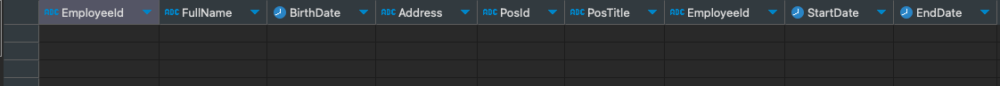
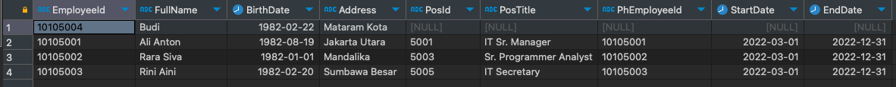

# DataAssessmentAKASIA

Welcome to the repository for the Data Engineer assessment at AKASIA. This project demonstrates a simple ETL (Extract, Transform, Load) process using SQL Server and Google BigQuery.

## Prerequisites

Before you begin, ensure you have the following:

- **SQL Server** hosted in Docker:
  - Find the official SQL Server Docker image at Docker Hub.
  - Run the following command to start your SQL Server instance:
    ```bash
    docker run -e "ACCEPT_EULA=Y" -e "MSSQL_SA_PASSWORD=Password123" -e "MSSQL_PID=Evaluation" -p 1433:1433 --name sqlpreview --hostname sqlpreview -d mcr.microsoft.com/mssql/server:2022-preview-ubuntu-22.04
    ```
  - Your SQL Server will now be hosted on localhost!

- **Google Cloud Platform (GCP)** account with BigQuery enabled.

## Usage Instructions

1. **Prepare SQL Server Data:**
   - Execute the script located at `DataAssesmentAKASIA/Scripts/DataAndQueryTask/script.sql` using your preferred SQL editor.
   - Our SQL Server data is now ready for the next steps.
   - We can display all employee data with their current position (current year is 2024, so the query will return nothing since every potition ended at december 2022) information by
     ```
        SELECT e.EmployeeId, e.FullName, e.BirthDate, e.Address,
            ph.PosId, ph.PosTitle, ph.EmployeeId, ph.StartDate, ph.EndDate
        from master.dbo.Employee e 
        left join master.dbo.PositionHistory ph 
            on e.EmployeeId = ph.EmployeeId 
        where cast(GETDATE() as date) between ph.StartDate and ph.EndDate;
     ```
    

    - We can display also the latest position for all the employee by
     ```
        with cte as (
        SELECT e.EmployeeId, e.FullName, e.BirthDate, e.Address,
            ph.PosId, ph.PosTitle, ph.EmployeeId as PhEmployeeId, ph.StartDate, ph.EndDate,
            ROW_NUMBER() over (PARTITION by ph.EmployeeId order by ph.StartDate desc) as rn
        from master.dbo.Employee e 
        left join master.dbo.PositionHistory ph 
            on e.EmployeeId = ph.EmployeeId
        )
        select EmployeeId, FullName, BirthDate, Address,
            PosId, PosTitle, PhEmployeeId, StartDate, EndDate
        from cte 
        where rn = 1;
     ```
     


2. **Configure BigQuery:**
   - Define the table schema for `PositionHistory` data within BigQuery.
   - Set the data source to your Spreadsheet. This will synchronize the Spreadsheet data with the BigQuery table in real-time.

3. **Run ETL Process:**
   - Navigate to the ETL script directory:
     ```bash
     cd DataAssesmentAKASIA/Scripts/ETLDataWarehouseAndAnalytics\ Task
     ```
   - Activate the Python virtual environment:
     ```bash
     source python-env/bin/activate
     ```
   - Install the required Python packages:
     ```bash
     pip install -r requirements.txt
     ```
   - Execute the ETL script:
     ```bash
     python etl.py
     ```

4. **View Results:**
   - Historical training data for employees can be found at `DataAssesmentAKASIA/Scripts/ETLDataWarehouseAndAnalytics Task/historical_training_data.csv`.
   - The combined SQL Server data and Spreadsheet data are now available in your BigQuery Data Warehouse.
   - Access the Looker dashboard to visualize your data [here](https://lookerstudio.google.com/reporting/aa572934-180d-43ed-b901-1c8a8a62d46b)

